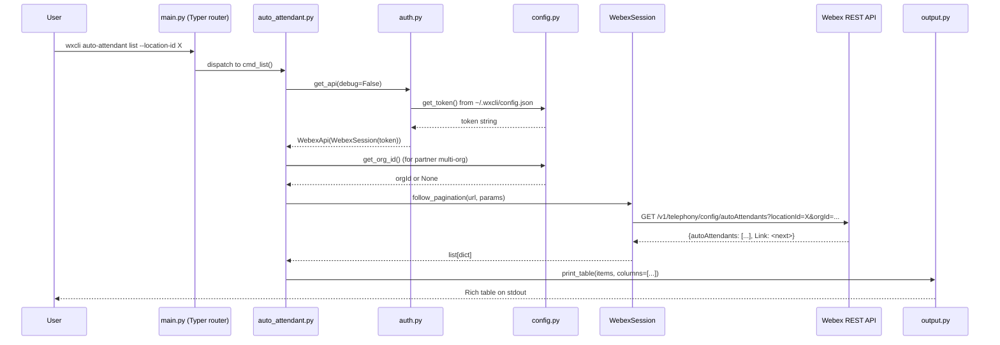
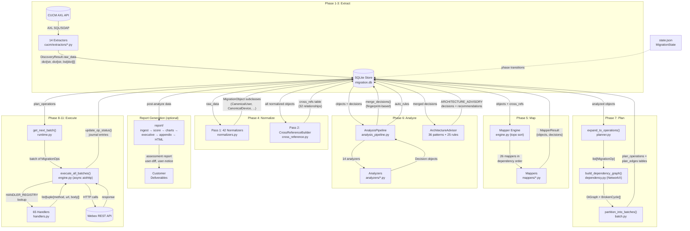
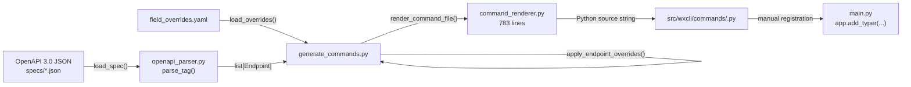

# Structural Map — wxcli

## 1. Module Inventory

| Module | Purpose | Primary Entry Points |
|--------|---------|---------------------|
| `src/wxcli/` (core) | CLI framework: auth, config, output formatting, error handling | `main.py:app` (Typer root), `auth.py:get_api()`, `config.py:load_config()` |
| `src/wxcli/commands/` | 208 command files — each registers a Typer sub-app for one API tag | Every `*.py` exports an `app = typer.Typer(...)` imported by `main.py` |
| `src/wxcli/migration/` | 11-phase CUCM-to-Webex migration pipeline | `commands/cucm.py` (CLI surface), `transform/pipeline.py:normalize_discovery()`, `transform/engine.py` (mapper execution), `transform/analysis_pipeline.py:AnalysisPipeline.run()`, `execute/planner.py:expand_to_operations()`, `execute/engine.py:execute_all_batches()` |
| `src/wxcli/org_health/` | Deterministic org health assessment — collect, analyze, report | `analyze.py:run_analysis()` (`python3.14 -m wxcli.org_health.analyze`), `report.py:generate_report()` |
| `tools/` | Code generation pipeline: OpenAPI spec → Python command files | `generate_commands.py:main()`, `openapi_parser.py:parse_tag()`, `command_renderer.py:render_command_file()` |
| `specs/` | 9 OpenAPI 3.0 JSON specs — the source of truth for API surface | Read by `tools/openapi_parser.py` and `tools/generate_commands.py` |
| `tests/` | 226 test files covering core, migration (2778 tests), org health (76 tests) | `pytest tests/ -m "not live"` |
| `.claude/agents/` | 2 Claude Code agent definitions (builder, migration-advisor) | Invoked via `/agents` in Claude Code |
| `.claude/skills/` | 26 domain skills for guided Webex operations | Invoked via `Skill` tool or `/skill-name` |
| `docs/reference/` | 46 API reference docs (originally built from wxc_sdk + wxcadm source; now maintained independently with wxcli CLI examples + raw HTTP) | Read by skills and agents at runtime |
| `docs/knowledge-base/migration/` | 8 structured KB docs for the Opus migration advisor | Read by `migration-advisor` agent during decision review |

---

## 2. Data Flow

### 2a. Running a Single wxcli Command

A user runs e.g. `wxcli auto-attendant list --location-id X`.

**Data shapes at each boundary:**

| Boundary | Shape |
|----------|-------|
| Config → Auth | `str` (bearer token) |
| Auth → Command | `WebexApi` wrapping `WebexSession` |
| Session → API | HTTP GET with `Authorization: Bearer ...` header, query params as `dict[str, str]` |
| API → Session | JSON dict with item key (e.g. `"autoAttendants"`) + optional `Link` header for pagination |
| Session → Command | `list[dict]` (all pages merged) |
| Command → Output | `list[dict]` + `list[tuple[str, str]]` (column definitions: header, accessor) |

**State:** Token lives in `~/.wxcli/config.json` (profiles.default.token). OrgId optionally in the same file. No other persistent state for read commands. Write commands return the API response (or just the created ID with `-o id`).

**Key files:**
- `src/wxcli/main.py:8-12` — Typer app creation, `main.py:198-199` — auto_attendant registration
- `src/wxcli/auth.py:14-60` — `WebexSession` (HTTP methods + pagination)
- `src/wxcli/auth.py:67-77` — `resolve_token()` (env var cascade: `WEBEX_ACCESS_TOKEN` → `WEBEX_TOKEN` → config file)
- `src/wxcli/config.py:1-6` — config path `~/.wxcli/config.json`
- `src/wxcli/output.py:41-71` — `print_table()` with auto-column detection
- `src/wxcli/errors.py:48-68` — `handle_rest_error()` with error code → actionable tip mapping
- `src/wxcli/commands/auto_attendant.py` — representative generated command (all 208 follow this pattern)

---

### 2b. CUCM Migration Pipeline (discover → execute)

The full pipeline has 11 phases. Data flows through a SQLite store (`MigrationStore`) that persists between phases. A JSON state machine (`MigrationState`) tracks the current phase.

**Data shapes at key boundaries:**

| Boundary | Shape |
|----------|-------|
| AXL → Extractors | Raw CUCM dicts (XML → dict via zeep) |
| Extractors → Store | `DiscoveryResult.raw_data`: `dict[str, dict[str, list[dict]]]` keyed by extractor name → sub-key → list of raw items |
| Normalizers → Store | `MigrationObject` subclasses (Pydantic models, serialized to JSON in `objects.data`) |
| CrossReferenceBuilder → Store | `cross_refs` table rows: `(from_id, to_id, relationship, ordinal)` — 32 unique relationship types across 16 builder methods |
| Mappers → Store | `MapperResult` containing `objects_created`, `objects_updated`, `decisions: list[Decision]` |
| Analyzers → Pipeline | `list[Decision]` — each with `fingerprint`, `type`, `severity`, `options`, `context` |
| Planner → DAG | `list[MigrationOp]` — each with `canonical_id`, `op_type`, `resource_type`, `tier`, `depends_on` |
| DAG → Store | `plan_operations` + `plan_edges` tables (NetworkX DiGraph persisted to SQLite) |
| Handler → Engine | `list[tuple[str, str, dict|None]]` — `[(method, url, body), ...]` or `SkippedResult(reason)` |

**State persistence:**
- `migration.db` (SQLite, WAL mode): 7 tables — `objects`, `cross_refs`, `decisions`, `journal`, `merge_log`, `plan_operations`, `plan_edges`
- `state.json`: project-level state machine (15 states, validated transitions)
- `config.json`: project-specific settings (site prefix rules, auto-rule config, bulk thresholds)

**Key files:**
- `src/wxcli/migration/store.py:33-53` — `MigrationStore.__init__()`, SQLite schema (7 tables)
- `src/wxcli/migration/state.py:19-58` — `ProjectState` enum (15 states) + `VALID_TRANSITIONS`
- `src/wxcli/migration/transform/pipeline.py:39-271` — `normalize_discovery()` (Pass 1 + Pass 2 orchestration)
- `src/wxcli/migration/transform/normalizers.py` — 42 normalizer functions + `RAW_DATA_MAPPING` routing table
- `src/wxcli/migration/transform/cross_reference.py` — `CrossReferenceBuilder.build()` (32 relationship types across 16 builder methods, plus `_classify_phone_models` enrichment)
- `src/wxcli/migration/transform/engine.py` — mapper execution engine (topological sort on `depends_on`)
- `src/wxcli/migration/transform/analysis_pipeline.py` — `AnalysisPipeline.run()` (14 analyzers + merge + auto-rules + advisor)
- `src/wxcli/migration/advisory/advisor.py` — `ArchitectureAdvisor` (runs after 14 analyzers, produces `ARCHITECTURE_ADVISORY` decisions)
- `src/wxcli/migration/advisory/advisory_patterns.py` — 36 detect/recommend pattern functions in `ALL_ADVISORY_PATTERNS`
- `src/wxcli/migration/advisory/recommendation_rules.py` — 25 per-decision recommendation rules
- `src/wxcli/migration/report/` — 7,692 lines: assessment report generation (ingest → score → charts → executive summary → appendix → HTML/PDF). Also produces user-diff and user-notice deliverables.
- `src/wxcli/migration/execute/planner.py:1-17` — `expand_to_operations()` with `PlannerSkipReport`
- `src/wxcli/migration/execute/dependency.py` — `build_dependency_graph()` (NetworkX, 30 cross-object rules)
- `src/wxcli/migration/execute/engine.py:1-88` — async executor with rate limiting, 429/409 handling
- `src/wxcli/migration/execute/handlers.py` — 65 handlers in `HANDLER_REGISTRY`
- `src/wxcli/migration/execute/runtime.py` — `get_next_batch()`, `update_op_status()`, cascade skip/retry

---

### 2c. Code Generation Pipeline (OpenAPI Spec → Command File)

**Data shapes:**

| Boundary | Shape |
|----------|-------|
| JSON spec → Parser | `dict` (OpenAPI 3.0 document) |
| Parser → Generator | `list[Endpoint]` — each `Endpoint` has `method`, `url_path`, `path_vars: list[str]`, `query_params: list[EndpointField]`, `body_fields: list[EndpointField]`, `command_name`, `command_type` |
| `EndpointField` | `name`, `python_name`, `field_type`, `description`, `required`, `default`, `enum_values` |
| Overrides → Generator | `dict` from YAML — `skip_tags`, `omit_query_params`, `auto_inject_from_config`, per-tag `table_columns` |
| Renderer → File | Python source code string (one Typer command per Endpoint) |

**What the renderer produces for each Endpoint:**

Each Endpoint becomes one `@app.command()` function following a fixed template:
1. Typer Options/Arguments from `path_vars` + `query_params` + `body_fields`
2. `get_api()` call for auth
3. URL construction with path variable interpolation
4. `get_org_id()` injection if `orgId` in `auto_inject_params`
5. HTTP call via `WebexSession` (GET uses `follow_pagination()` for list commands)
6. Output dispatch: `print_table()` or `print_json()` based on `--output` flag

**Key files:**
- `tools/postman_parser.py:11-42` — `Endpoint` and `EndpointField` dataclasses (shared model)
- `tools/openapi_parser.py:1-79` — `load_spec()`, `resolve_ref()`, `get_tags()`, `parse_tag()`
- `tools/command_renderer.py` (783 lines) — `render_command_file()`, template logic, `folder_name_to_module()`
- `tools/generate_commands.py:64-116` — `generate_tag()` orchestration, `main()` CLI with multi-spec support
- `tools/field_overrides.yaml` — per-tag table columns, skip tags, CLI name overrides

---

## 3. Key Abstractions

### Core CLI

| Abstraction | What It Represents | Where It Lives | Dependents |
|-------------|-------------------|----------------|------------|
| `WebexSession` | Authenticated HTTP client (synchronous httpx) with pagination support | `src/wxcli/auth.py:14-60` | Every generated/hand-coded command file. **Not** used by migration execution engine (which uses aiohttp directly). |
| `WebexApi` | Thin wrapper holding a `WebexSession` | `src/wxcli/auth.py:62-64` | Every command's `get_api()` call |
| `WebexError` | API error with JSON body | `src/wxcli/errors.py:6-7` | `handle_rest_error()`, all commands |
| Config profile | `~/.wxcli/config.json` with token, org_id, cc_region | `src/wxcli/config.py:1-110` | Auth, every command needing org context |

### Code Generator

| Abstraction | What It Represents | Where It Lives | Dependents |
|-------------|-------------------|----------------|------------|
| `Endpoint` | One API operation (method + URL + params + body + output config) | `tools/postman_parser.py:22-42` | Parser, renderer, generator |
| `EndpointField` | One parameter or body field with type info | `tools/postman_parser.py:11-20` | `Endpoint`, renderer |
| Field overrides | Per-tag customization (table columns, skip rules, CLI name overrides) | `tools/field_overrides.yaml` | Generator, renderer |

### Migration Pipeline

| Abstraction | What It Represents | Where It Lives | Dependents |
|-------------|-------------------|----------------|------------|
| `MigrationObject` | Base class for all migratable entities — tracks `canonical_id`, `status`, `provenance`, `errors`, `depends_on` | `src/wxcli/migration/models.py:145-157` | All 38 canonical types, store, normalizers, mappers, analyzers, planner |
| `MigrationStatus` | 12-state lifecycle enum: `discovered` → `normalized` → `analyzed` → `planned` → `executing` → `completed` | `src/wxcli/migration/models.py:26-44` | Store queries, pipeline gating, planner skip logic |
| `Provenance` | Where an object came from (source system, source ID, cluster, timestamp) | `src/wxcli/migration/models.py:133-142` | Every `MigrationObject` |
| `Decision` | A migration conflict requiring resolution — has `type`, `severity`, `options`, `fingerprint`, `chosen_option` | `src/wxcli/migration/models.py:173-197` | 14 analyzers, 26 mappers, merge logic, planner skip logic, advisory system |
| `DecisionType` | 27-value enum of all possible decision categories | `src/wxcli/migration/models.py:84-126` | Decision creation, auto-rules, advisory patterns, report generation |
| `MigrationStore` | SQLite-backed persistence for objects, cross-refs, decisions, journal, execution plan | `src/wxcli/migration/store.py:33-861` | Every pipeline phase |
| `MigrationState` | JSON-backed project-level state machine (15 states, validated transitions) | `src/wxcli/migration/state.py:65-139` | CLI commands, phase gating |
| `MigrationOp` | One node in the execution DAG — `canonical_id` + `op_type` + `resource_type` + `tier` | `src/wxcli/migration/execute/__init__.py:35-47` | Planner, dependency graph, batcher, runtime, engine |
| `DependencyType` | Edge labels in the DAG: `REQUIRES` (hard), `CONFIGURES` (hard), `SOFT` (breakable) | `src/wxcli/migration/execute/__init__.py:22-28` | Dependency graph builder, cycle breaker |
| `MapperResult` | Return type from each mapper: counts + decisions produced | `src/wxcli/migration/models.py:200-206` | Mapper engine, analysis pipeline |
| `HandlerResult` | Return type from execution handlers: `list[tuple[method, url, body]]` or `SkippedResult` | `src/wxcli/migration/execute/handlers.py` | Engine, runtime |
| `PlannerSkipReport` | Aggregate record of all entities skipped during planning (visibility against silent failures) | `src/wxcli/migration/execute/planner.py:55-99` | Planner, CLI status output |

**Dispatch registries** — the pipeline uses four key dispatch tables that route data through the correct processing function:

| Registry | What It Maps | Size | Where It Lives |
|----------|-------------|------|----------------|
| `NORMALIZER_REGISTRY` | normalizer key → normalizer function | 42 entries | `transform/normalizers.py` |
| `RAW_DATA_MAPPING` | `(extractor_key, sub_key, normalizer_key)` routing table | ~40 entries | `transform/normalizers.py` |
| `CANONICAL_TYPE_REGISTRY` | type string → Pydantic class (e.g. `"user"` → `CanonicalUser`) | 38 entries | `models.py` |
| `_EXPANDERS` | object type → expander function (e.g. `"user"` → `_expand_user`) | 36 entries | `execute/planner.py` |
| `HANDLER_REGISTRY` | `(resource_type, op_type)` → handler function | 65 entries | `execute/handlers.py` |
| `TIER_ASSIGNMENTS` | `(resource_type, op_type)` → tier number (0-8) | ~40 entries | `execute/__init__.py` |
| `_CROSS_OBJECT_RULES` | list of dependency edge rules for the DAG | 30 rules | `execute/dependency.py` |
| `ALL_ADVISORY_PATTERNS` | list of detect/recommend functions | 36 patterns | `advisory/advisory_patterns.py` |

**Canonical type hierarchy** (38 types total, all extending `MigrationObject`):

| Category | Types |
|----------|-------|
| Infrastructure (6) | `CanonicalLocation`, `CanonicalTrunk`, `CanonicalRouteGroup`, `CanonicalRouteList`, `CanonicalDialPlan`, `CanonicalTranslationPattern` |
| Users/Devices (4) | `CanonicalUser`, `CanonicalLine`, `CanonicalDevice`, `CanonicalWorkspace` |
| Call Features (6) | `CanonicalHuntGroup`, `CanonicalCallQueue`, `CanonicalAutoAttendant`, `CanonicalCallPark`, `CanonicalPickupGroup`, `CanonicalPagingGroup` |
| Scheduling (2) | `CanonicalOperatingMode`, `CanonicalLocationSchedule` |
| Voicemail (2) | `CanonicalVoicemailProfile`, `CanonicalVoicemailGroup` |
| Line/Extension (3) | `CanonicalSharedLine`, `CanonicalVirtualLine`, `CanonicalMonitoringList` |
| Person Settings (4) | `CanonicalExecutiveAssistant`, `CanonicalCallingPermission`, `CanonicalCallForwarding`, `CanonicalSingleNumberReach` |
| Device Config (5) | `CanonicalLineKeyTemplate`, `CanonicalDeviceLayout`, `CanonicalSoftkeyConfig`, `CanonicalDeviceSettingsTemplate`, `CanonicalDeviceProfile` |
| Audio (2) | `CanonicalMusicOnHold`, `CanonicalAnnouncement` |
| Emergency (2) | `CanonicalE911Config`, `CanonicalEcbnConfig` |
| Other (2) | `CanonicalReceptionistConfig`, `CanonicalDECTNetwork` |

### Org Health

| Abstraction | What It Represents | Where It Lives | Dependents |
|-------------|-------------------|----------------|------------|
| `Finding` | One health check result: severity + detail + affected items + recommendation | `src/wxcli/org_health/models.py:7-17` | 18 check functions, analyzer, report |
| `HealthResult` | Aggregate assessment: categories, findings, org stats | `src/wxcli/org_health/models.py:62-78` | Analyzer, report generator |
| `@check(category)` decorator | Registry pattern for check functions | `src/wxcli/org_health/checks.py` | `run_all_checks()` |

---

## 4. Boundaries

### Stable Interfaces (contracts other code depends on)

| Boundary | Contract | Stability |
|----------|----------|-----------|
| **Config file format** (`~/.wxcli/config.json`) | `{profiles: {default: {token, org_id, org_name, cc_region, expires_at}}}` | Stable — changing this breaks every existing installation |
| **`WebexSession` API** | `.rest_get()`, `.rest_post()`, `.rest_put()`, `.rest_delete()`, `.follow_pagination()` — all return `dict` | Stable — every command file depends on this (migration engine uses aiohttp independently) |
| **`Endpoint`/`EndpointField` dataclasses** | Fields in `tools/postman_parser.py:11-42` | Stable — parser and renderer must agree on this shape |
| **`MigrationStore` schema** | 7 SQLite tables (`objects`, `cross_refs`, `decisions`, `journal`, `merge_log`, `plan_operations`, `plan_edges`) | Stable — schema migrations exist (`ALTER TABLE ADD COLUMN`) but tables are never removed or renamed. Existing project databases must remain loadable. |
| **`MigrationObject.canonical_id` format** | `"type:name"` convention (e.g., `"user:jsmith"`, `"device:SEP001122334455"`) | Stable — cross_refs, planner, handlers all parse this prefix to determine type |
| **`HANDLER_REGISTRY` contract** | `(resource_type, op_type) → handler_fn(data, deps, ctx) → HandlerResult` | Stable — engine dispatches to handlers by this key |
| **`TIER_ASSIGNMENTS` dict** | `(resource_type, op_type) → int` | Stable — changing tier numbers reorders execution and can break dependency assumptions |
| **Decision fingerprint** | `SHA256(type + context)` — same input = same fingerprint across runs | Stable — `merge_decisions()` relies on fingerprints to match old and new decisions |
| **CLI command names** | `wxcli <group> <command>` (e.g., `wxcli auto-attendant list`) | Semi-stable — generated from spec tags, but hand-coded aliases exist (`users` → `people`, `cx-essentials` → `customer-assist`) |

### Internal Implementation (can change freely)

| Boundary | What's Behind It |
|----------|-----------------|
| **Individual normalizer functions** | 42 functions in `normalizers.py` — stateless, can be added/removed/rewritten without affecting pipeline contract |
| **Individual mapper classes** | 26 mappers in `mappers/` — each independent, only coupled via `depends_on` declarations |
| **Individual analyzer classes** | 14 analyzers in `analyzers/` — same pattern |
| **Individual handler functions** | 65 handlers — each a pure function, can be rewritten as long as the `(data, deps, ctx) → HandlerResult` signature holds |
| **Renderer template logic** | `command_renderer.py` internals — can change freely as long as output is valid Python registering a Typer command |
| **Report HTML generation** | `migration/report/*.py`, `org_health/report.py` — visual output, no external consumers |
| **Advisory patterns** | `advisory/advisory_patterns.py`, `advisory/recommendation_rules.py` — heuristics, frequently tuned |

### Seams Worth Noting

1. **Generated vs hand-coded commands.** 208 files are generated from OpenAPI specs; 8 are hand-coded and registered as Typer sub-apps in `main.py`: `update.py` (self-update via git pull), `configure.py` (auth setup), `locations.py`, `numbers.py`, `licenses.py` (3 legacy files that predate the generator), `cucm.py` (16-command migration CLI surface), `cleanup.py` (1,424-line batch deletion with 13-layer dependency ordering), plus `converged_recordings_export.py` (registers `download`/`export` onto the generated `converged_recordings` group). `cucm_config.py` is a helper imported by `cucm.py`, not directly registered. Hand-coded files drift from generator improvements (they don't get `auto_inject_from_config`, auto-column detection, etc.). The seam is `main.py` where both types are registered identically via `app.add_typer()`.

2. **Two independent HTTP stacks.** The migration execution engine (`execute/engine.py`) uses **async aiohttp** with semaphore-based rate limiting, 429 retry, and 409 auto-recovery. The CLI commands use **synchronous httpx** via `WebexSession`. These stacks share nothing — a breaking change in one doesn't affect the other. The migration pipeline never calls `get_api()` or uses any generated command file.

3. **Org health vs migration report.** `org_health/report.py` imports CSS and chart functions from `migration/report/styles.py` and `migration/report/charts.py`. This creates a coupling: changing the migration report's visual design affects org health reports too. The coupling is intentional (shared design system).

4. **Cleanup is not a normal command.** `commands/cleanup.py` (1,424 lines) is a hand-coded batch deletion engine with 13-layer dependency ordering, parallel `ThreadPoolExecutor` execution, async calling-config propagation waits, CCP-integrated error detection, and retry loops. It shares no code with the migration pipeline — it uses synchronous `WebexSession` but has its own inventory → parallel delete → retry logic. Architecturally more like a second execution engine than a CLI command.

5. **Skill/agent layer vs code.** The 26 skills and 2 agents in `.claude/` are markdown documents that instruct Claude Code how to use `wxcli` commands. They are not code — they're prompts. But they encode assumptions about command names, flags, and API behavior. When a command changes, the corresponding skill should be checked.

---

## 5. External Dependencies

### Runtime Dependencies (from `pyproject.toml`)

| Dependency | Version | What Uses It | Breakage Impact |
|------------|---------|-------------|-----------------|
| **typer** (+ rich, click, shellingham) | >= 0.9.0 | Every CLI command — the entire command tree | Total — CLI unusable |
| **httpx** | >= 0.27.0 | `WebexSession` (all synchronous API calls in commands and config) | Total for CLI commands; migration engine unaffected (uses aiohttp) |
| **pyyaml** | >= 6.0 | `field_overrides.yaml` loading in code generator | Generator-only — runtime unaffected |

### Undeclared Runtime Dependencies

These libraries are imported in source but not listed in `pyproject.toml`'s `dependencies`. They happen to be present because `wxc-sdk` appears in the stale `requirements.txt` (pip-compile output) and pulls them transitively — but `wxc-sdk` is NOT in `pyproject.toml` and is not imported anywhere in `src/wxcli/`. A clean `pip install -e .` would install only typer, httpx, and pyyaml, then fail at runtime when any migration code runs.

| Dependency | What Uses It | How It Gets Installed Today | Breakage on Clean Install |
|------------|-------------|---------------------------|--------------------------|
| **pydantic** | All 38 migration model classes, `Decision`, `MigrationOp`, `MapperResult` | Transitive via `typer[all]` (typer → pydantic) | **Safe** — typer[all] pulls it in |
| **aiohttp** | `execute/engine.py` async bulk executor | Transitive via stale `wxc-sdk` in environment | **Breaks** — migration execution fails with `ModuleNotFoundError` |
| **networkx** | `execute/dependency.py` + `execute/batch.py` DAG construction and cycle detection | Must be manually installed | **Breaks** — migration planning fails with `ModuleNotFoundError` |
| **rich** | `output.py` table rendering, `cleanup.py` console output | Transitive via `typer[all]` | **Safe** — typer[all] pulls it in |

**Action needed:** `aiohttp` and `networkx` should be added to `pyproject.toml` `dependencies` (or gated behind an `[extras]` like `wxcli[migration]`). The stale `requirements.txt` masks this gap in existing environments.

### External Systems

| System | Integration Point | What Would Break |
|--------|-------------------|-----------------|
| **Webex REST API** (`webexapis.com/v1`) | Every command, migration execution | Everything — the CLI is a thin wrapper over this API |
| **Webex Contact Center API** (`api.wxcc-{region}.cisco.com`) | 48 `cc-*` command groups | CC commands only; requires separate OAuth with `cjp:config_*` scopes |
| **CUCM AXL API** (customer premise) | `migration/cucm/connection.py`, 14 extractors | Migration discovery only — requires network access to CUCM cluster |
| **Unity Connection API** (customer premise) | `migration/cucm/unity_connection.py` | Voicemail extraction only |

### Development/Build Dependencies

| Dependency | What Uses It | Notes |
|------------|-------------|-------|
| **setuptools + setuptools-scm** | Build system, version from git tags | Standard Python packaging |
| **pytest + pytest-asyncio** | Test suite | 226 test files, `asyncio_mode = "auto"` |
| **Python >= 3.14** | Required by `pyproject.toml` | **Significant constraint.** Python 3.14 is in beta as of May 2026. The codebase uses `str | None` union syntax (available since 3.10) and `type` statement syntax. All `python3.14` invocations in skills and CLAUDE.md are hardcoded to this version. |

### Stale Dependency: wxc-sdk

`wxc-sdk==1.31.0` appears in `requirements.txt` (pip-compile output) with the comment `# via wxcli (pyproject.toml)`, but it is **not** in the current `pyproject.toml` and **no source file imports it** (`grep -r "wxc_sdk\|wxc-sdk" src/wxcli/` returns zero hits). It was likely a historical dependency that was removed from `pyproject.toml` without regenerating `requirements.txt`. The installed copy (`pip show` reports v1.23.0, not 1.31.0) provides `aiohttp` and `pydantic` transitively, masking the undeclared-dependency gap described above.

**Where wxc-sdk is still referenced** (cleanup in progress — see `docs/prompts/remove-wxc-sdk-references.md`):
- `requirements.txt` — stale pip-compile output
- `docs/reference/wxc-sdk-patterns.md` — historical SDK patterns doc (scopes table and raw HTTP examples are the valuable parts)
- Several skills contain `from wxc_sdk import ...` code examples that need rewriting
- `tools/CLAUDE.md` and root `CLAUDE.md` — reframed as historical source (already updated)
- `docs/reference/CLAUDE.md` — marked as historical (already updated)

### OpenAPI Specs (Input to Generator)

The 9 specs in `specs/` are periodically updated via `tools/update-specs.py` from GitHub. If Cisco changes the API spec structure (tag names, path patterns, response shapes), the generator may produce broken commands. The `field_overrides.yaml` layer exists specifically to handle spec-level quirks without modifying the parser.

---

## Appendix: File Count Summary

| Component | Files | Lines (approx) |
|-----------|-------|-----------------|
| Core (`src/wxcli/*.py`) | 7 | ~900 |
| Commands (`src/wxcli/commands/`) | 208 | ~120,000 (generated) |
| Migration (`src/wxcli/migration/`) | 114 | ~25,000 |
| Org Health (`src/wxcli/org_health/`) | 5 | ~1,500 |
| Tools (`tools/`) | 14 | ~160,000 (includes stress test/data generators) |
| Tests (`tests/`) | 226 | ~30,000 |
| Specs (`specs/`) | 9 | N/A (JSON) |
| Skills + Agents (`.claude/`) | 28 | N/A (markdown) |
| Reference Docs (`docs/reference/`) | 46 | N/A (markdown) |
